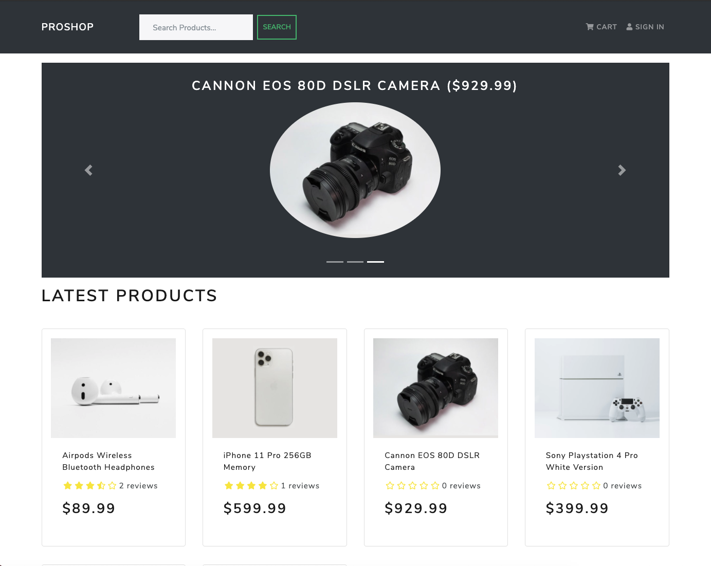

# PropShop Ecommerce Website With Django + React

# Features
* Full featured shopping cart
* Product reviews and ratings
* Top products carousel
* Product pagination
* Product search feature
* User profile with orders
* Admin product management
* Admin user management
* Admin Order details page
* Mark orders as delivered option
* Checkout process (shipping, payment method, etc)
* PayPal / credit card integration

# Download & Setup Instructions

* 1 - Clone project: git clone https://github.com/leon0719/ecommerce_React_Django.git
* 2 - cd ecommerce_React_Django
* 3 - Create virtual environment: virtualenv myenv
* 4 - source myenv/scripts/activate
* 5 - pip install -r requirements.txt
* 6 - python manage.py runserver

# Install react modules
* 1 - cd frontend
* 2 - npm install
* 3 - npm start
